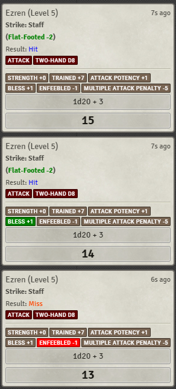
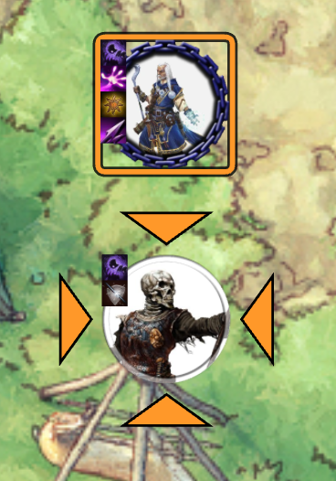
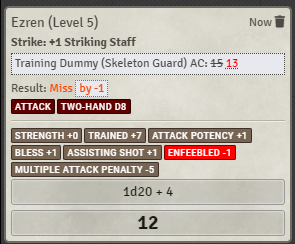
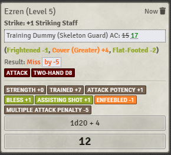
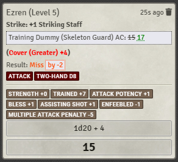

# [PF2e Modifiers Matter](https://foundryvtt.com/packages/pf2e-modifiers-matter/)

FoundryVTT module for the PF2e system, which highlights situations where status effects (buffs, debuffs, conditions)
change the outcome of a roll.

With this module, the players or Gamemaster can notice when one character helped support another, and point it out or
narrate it. For example, if the Fighter got a critical hit against a goblin only thanks to the Druid frightening the
goblin, or when the Fighter misses an attack due to the poison it was recently exposed to.

To install, browse for it in the module browser,
or [directly copy the manifest link for the latest release](https://github.com/itamarcu/pf2e-modifiers-matter/releases/latest/download/module.json)
.

Yes, technically this module is not about modifiers but about all the other things that modify a roll, which happen to
not be called modifiers, despite applying modifications. But "PF2e Highlight Status Effect Consequences" was too long.

# Features

## Basic Behavior - Add color to active roller's bonuses/penalties in chat cards

By default in the Pathfinder 2e system, when you make an attack roll, saving throw, or other check against a DC, the
chat card that shows the result of your roll will usually contain a summary of your bonuses and penalties based on your
conditions. Additionally, the card shows you if you succeeded or failed (and for GMs, shows exactly by how much).

This module **edits** the chat card to color these bonuses whenever they are relevant to a roll. In other words, when an
effect causes the outcome to change (by one or more degrees of success), the effect's bonus text on the card will be
colored green if it helped or red if it hurt.

This will only apply color to temporary effects - it will ignore effects such as proficiency, ability modifier, runes,
or potency bonus.

The color will be a strong red/green for an effect that directly caused a change in outcome (and was necessary for the
change). A less striking and less saturated red/green color will be used for effects that were helpful/hurtful but not
strictly necessary. For example, if you rolled a total of 17 against an enemy with AC 16, you hit (Success +1). If
you've been currently under the effects of both Bless (+1 status bonus) and Assisting Shot (+1 circumstance bonus), then
either of them would have helped you land your attack, but no one of them was necessary for the attack, so they'll both
be partially highlighted. If an effect was definitely not necessary for the change in outcome - due to another effect
being much more impactful - the unnecessary effect will not be colored at all.

## Extra - AC conditions

The module will also display similar status effect consequences when they apply to enemies' AC when making attacks
against them. This will add new text to the card (a setting exists to show or hide it from players). For example, it
will show up when an attack roll of 15 would normally miss the AC 16 goblin, except the goblin was flat-footed and had
its AC reduced to 14.

(also note that this will treat missed attacks and critically missed attacks as usual, meaning sometimes you'll see that
a condition turned a miss into a critical miss even when you don't care about it. This is because some game mechanics
may interact with missed versus critically missed attacks - for example: Dueling Riposte, Confident Finisher)

Sadly, I've not been able to show how similar status effects change the DC of spells, or the fortitude/reflex/will DCs
of creatures. I am also unable to do this with all Rule Elements (though I managed some basics like Cover). This will
hopefully be an upcoming feature.

## Examples

Example situation:

Ezren is attacking the skeleton with a stick. They both have a lot of effects on their actors.

Here you can see that the attack ended up as a critical hit (because total >= DC + 10). The flat-footed condition that
was applied to the skeleton has been crucial to get this outcome; the other three buffs (frightened skeleton, assisting
shot, bless)
were useful but only two of were needed (any two).

Same as above, but all conditions were necessary to get the crit.

A miss caused by Ezren's Frightened condition.

Note that Ezren was also Enfeebled, but due to Pathfinder 2e rules, since both of them apply "status"-type penalties one
of them is ignored by the system (in this case Enfeebled), and isn't shown on the chat card.

Fun example of a special case:  the positive conditions together are responsible for an outcome, and the negative
conditions together are responsible for an outcome, but also no one/single condition here was necessary to reach this
result. In a way, all of these status effects were equally important here.

In this example, the attack failed because the skeleton had greater cover (+4 to AC). Even though Ezren is also
frightened the frightened condition modifier on this card will not be highlighted because it did not affect the outcome
whatsoever.

## Credits

Thanks Sionth#5174 for coming up with a name for this!

## Accessibility

Feel free to contact me if you want different colors instead of red and green, telling me which colors work best for
you, and I'll add a setting to the module.